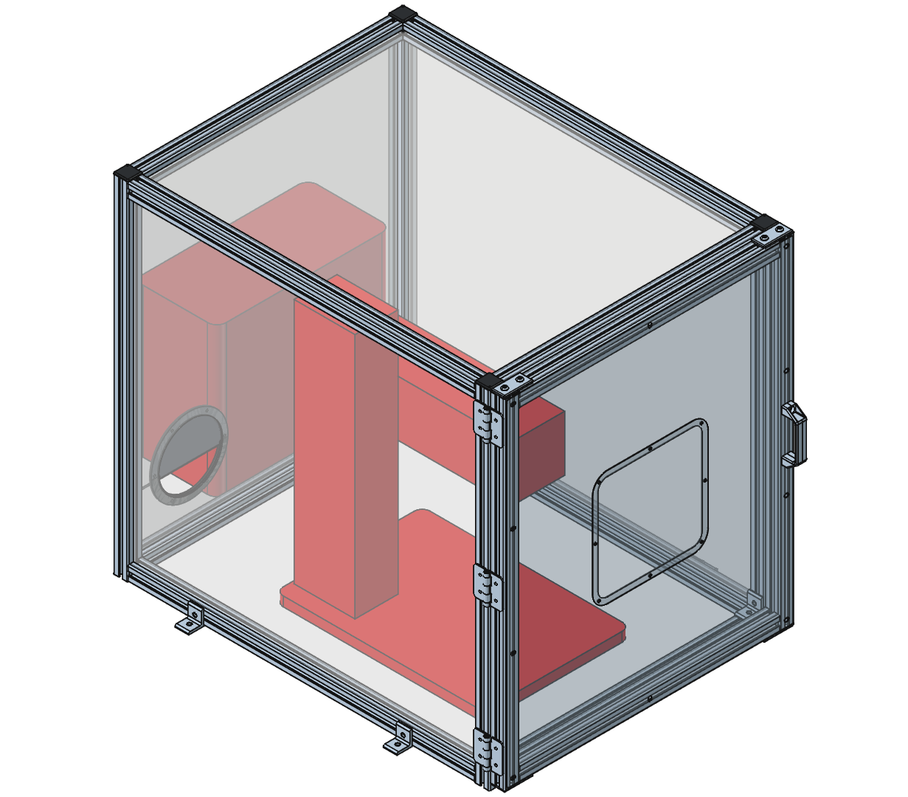
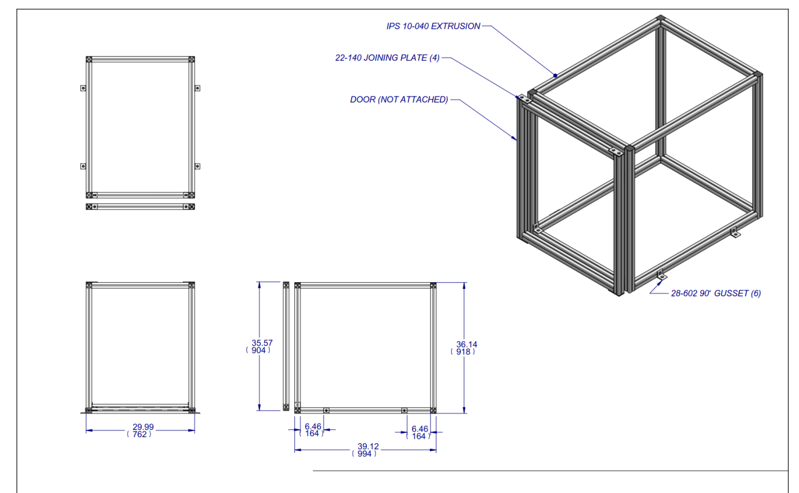
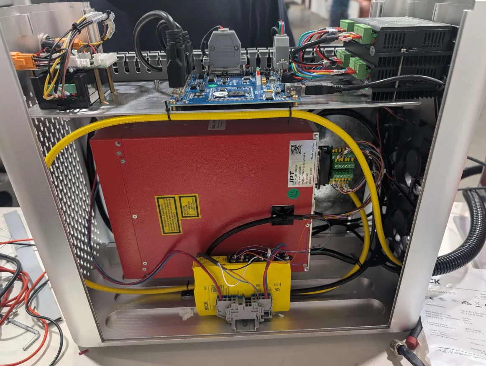
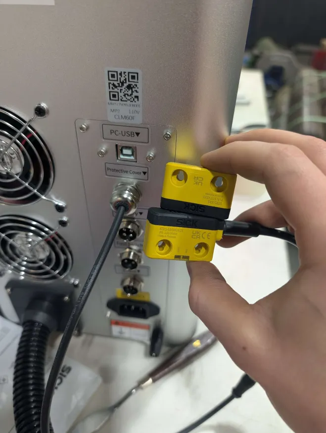

## Engraver Box

> It's like Schrodinger's cat: You don't know if the laser is on unless you open the box, collapse the wave function, and shoot your eye out!
> -- Mitch

A laser safe enclosure to fit most common Chinese laser engravers.

- [CAD files](./CAD)
- [dxf files for some parts](./dxf)

## ⚠ Warning ⚠

Lasers are dangerous. You are responsible for ensuring the safety of your equipment, and its compliance with local laws and regulations.

## Example interlock switch wiring

There is probably enough space in the control cabinet of your laser engraver to fit a safety relay. 24V power can be borrowed from an existing PSU in the cabinet.

Replace the existing fake "door interface" connection on the back of the cabinet with a pigtail cable for your door switch.

Use two of the output channels on your safety relay to interrupt the Emission enable and E-Stop signals from the laser controller to the laser. **You may need to enable the use of the E-Stop signal in the Laser software!** Here is an example pinout for a JPT M7 laser:

Example Bill of Materials:

- [STR1-SASM0AC5](https://www.sick.com/us/en/catalog/products/safety/safety-switches/str1/str1-sasm0ac5/p/p416363?tab=detail)
- [YF2A15-050UB5M2A15](https://www.sick.com/us/en/catalog/products/network-and-connection-technology/connectors-and-cables/sensor-actuator-cables/yf2a15-050ub5m2a15/p/p559359?tab=detail)
- [YF2A15-010UB5XLEAX](https://www.sick.com/us/en/catalog/products/network-and-connection-technology/connectors-and-cables/sensor-actuator-cables/yf2a15-010ub5xleax/p/p603653)
- [RLY3-OSSD300](https://www.sick.com/us/en/catalog/products/safety/safety-relays/rely/rly3-ossd300/p/p655584)

## License

MIT or CERN-OHL-P, at your option.
